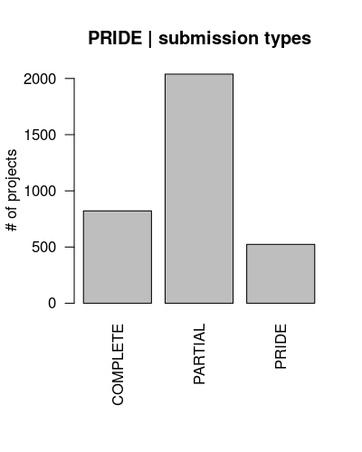

# About pRideMetadb
A R-package for meta data query of [PRIDE](http://www.ebi.ac.uk/pride/archive/) database. It provides detail status of PRIDE database for R-user. many useful functions to query PRIDE database.

# Examples
## getPrideProject function

Load neccessary library and functions. [`pRide-api.R`](../R/pRide-api.R) contains all the major functions to retrieve required informations from PRIDE database. Additional helper functions are available in [`utils.R`](../R/utils.R) and [`zzz.R`](../R/zzz.R).
```{r}
# remove all existing variables from R-workspace
rm(list=ls())
# load httr package
library(httr)
# load pRideMetadb functions
source('./R/pRide-api.R')
source('./R/utils.R')
source('./R/zzz.R')
# pxd = "PXD005227"
pxd.data <- getPrideProject(pxd=pxd)
# Respose >>>> "OK"
names(pxd.data)
# [1] "accession"                "title"                   
# [3] "projectDescription"       "publicationDate"         
# [5] "submissionType"           "numAssays"               
# [7] "species"                  "tissues"                 
# [9] "ptmNames"                 "instrumentNames"         
#[11] "projectTags"              "doi"                     
#[13] "submitter"                "labHeads"                
#[15] "submissionDate"           "reanalysis"              
#[17] "experimentTypes"          "quantificationMethods"   
#[19] "keywords"                 "sampleProcessingProtocol"
#[21] "dataProcessingProtocol"   "otherOmicsLink"          
#[23] "numProteins"              "numPeptides"             
#[25] "numSpectra"               "numUniquePeptides"       
#[27] "numIdentifiedSpectra"     "references"
```

## getProjectList
Get projects available in PRIDE-database.
```{r}
page1Results <- getProjectList(
    resultsPerPage = 10, # per page content
    page = 1 # page number; starts from 0
    )
# Respose >>>> "OK"
```

## getProjectCount
Get number of available projects in PRIDE-database. Many parameters are available to query PRIDE-database. By default, `getProjectCount` returns total numebr of PRIDE projects. 
```{r}
getProjectCount()
# Respose >>>> "OK"
# 2017-02-06 19:56:10 
# Number of PRIDE projects = 3385
# [1] 3385
```

## getAllPrideProject
Get all PRIDE projects from PRDIE-database. Maximum results per page allowed is 500, by default it allows 100 result per page. It uses `getProjectList` function to retrieve projects page-wise.
```{r}
#------------------
# download all projects available in PRIDE
allPrideProjects <- getAllPrideProject(
    resultsPerPage = 500
    )

# Respose >>>> "OK"
# 2017-02-06 20:01:15
# Number of PRIDE projects = 3385
# Respose >>>> "OK"
# Page 0
# Number of results = 500
# Respose >>>> "OK"
# Page 1
# Number of results = 500
# Respose >>>> "OK"
# Page 2
# Number of results = 500
# Respose >>>> "OK"
# Page 3
# Number of results = 500
# Respose >>>> "OK"
# Page 4
# Number of results = 500
# Respose >>>> "OK"
# Page 5
# Number of results = 500
# Respose >>>> "OK"
# Page 6
# Number of results = 385
# 2017-02-06 20:02:34
# Number of PRIDE projects downloaded = 3385
#------------------
# availbale contents
names(allPrideProjects[[1]])
#------
# save the content
save(allPrideProjects, file = './data/allPrideProjects.rda')
# [1] "accession"          "title"              "projectDescription"
# [4] "publicationDate"    "submissionType"     "numAssays"         
# [7] "species"            "tissues"            "ptmNames"          
#[10] "instrumentNames"    "projectTags"
```

## Status and visualization of PRIDE projects
Let us now visualize our downloaded data set `allPrideProjects.rda`. Status of submission types in PRIDE database.

```{r}
load('./data/allPrideProjects.rda')
prideAllDF <- prideAllList2DF(prideAllList)
# submission types
tb.submissionType <- table(prideAllDF$submissionType)
png('./vignettes/pride-submissionType.png',
width=400, height=500, res= 100)
par(mar = c(8.1,4.1,4.1,2.1))
barplot(tb.submissionType,
    las = 2,
    ylab = '# of projects',
    main = 'PRIDE | submission types')
dev.off()
```
